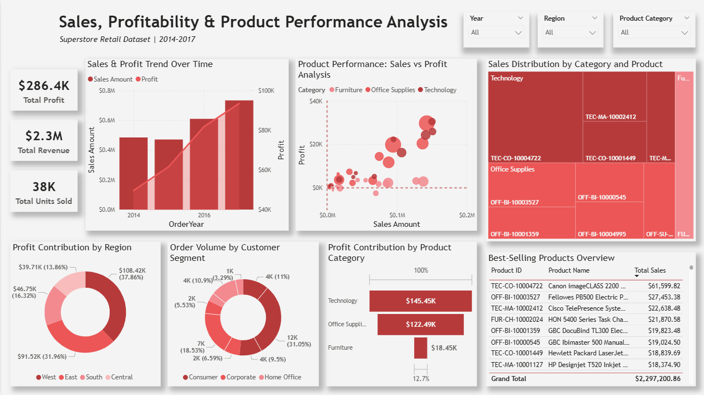
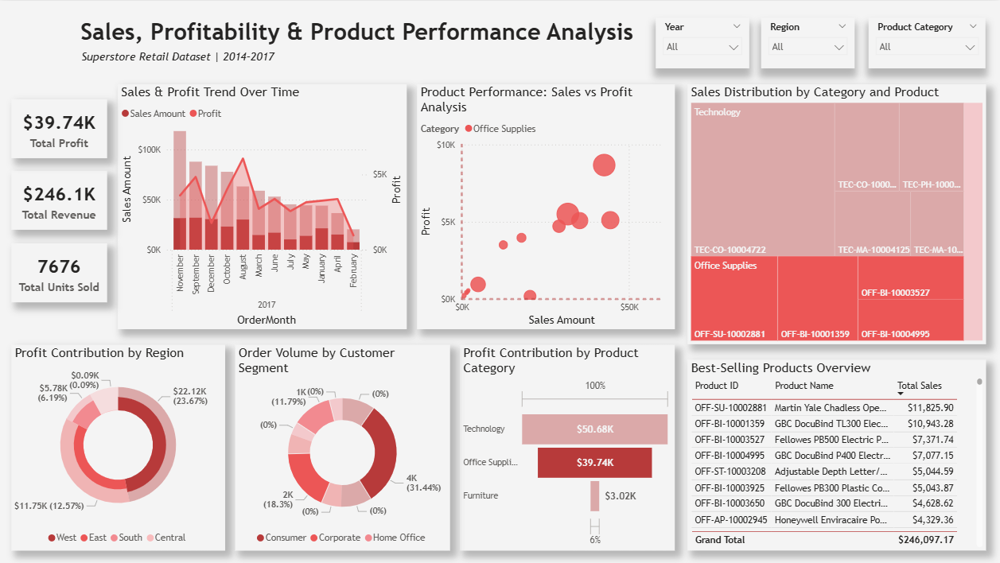

# Sales & Profitability Analysis Dashboard (Power BI)
Sales and profitability analysis dashboard built in Power BI using DAX, data modeling, and interactive business intelligence visualizations. This project demonstrates how transactional sales data can be transformed into actionable business insights to support strategic decision-making.

## Project Overview

The objective of this project is to evaluate overall business performance by identifying revenue drivers, profitable product categories, regional contribution, and customer purchasing behavior.

The dashboard enables stakeholders to:

* Monitor sales and profit performance over time.
* Identify high-performing and low-margin products.
* Analyze customer segment contribution.
* Evaluate regional profitability trends.

## Analytical Approach

This project follows a basic business analysis approach to better understand sales performance and profitability.

1. **Sales Performance Monitoring**

   * Reviewed overall sales and profit trends to observe business growth over time.

2. **Profitability Analysis**

   * Compared sales and profit values to identify products generating strong revenue but lower profit margins.

3. **Customer Segment Analysis**

   * Examined purchasing patterns across customer segments to understand which groups contribute most to sales.

4. **Regional Performance Review**

   * Analyzed regional results to identify areas with higher and lower profit contribution.

5. **Product Performance Analysis**

   * Ranked products based on total sales to highlight top-performing items.

This approach helped transform raw sales data into insights that support basic business decision-making.

## Tools & Technologies

* Power BI Desktop
* Power Query (ETL & Data Transformation)
* DAX (Data Analysis Expressions)
* Data Modeling
* Interactive Data Visualization

## Dashboard Preview
### Executive Overview

### Category Analysis Overview

## Dashboard Features & Technical Implementation

### Date Hierarchy & Drill-Down Analysis

* Created custom:
**Year → Month → Date** |
**Category → Sub-Category → Product Name** |
**Region → State → City** hierarchy.
* Enabled multi-level time analysis.
* Supports drill-down exploration of sales trends.

### KPI Monitoring

Developed dynamic KPI measures for:

* Total Sales
* Total Profit
* Total Quantity Sold

Providing an executive-level performance overview.

### Interactive Filtering

Implemented slicers allowing dynamic analysis by:

* Year
* Region
* Product Category

### Advanced Visual Analytics

* Combo Chart for Sales vs Profit trends.
* Scatter Plot for product profitability analysis.
* Treemap for category distribution.
* Donut Charts for regional and segment contribution.
* Ranked table highlighting top-performing products.
  
### Data Modeling

* Established relationships between tables.
* Optimized aggregation behavior.
* Ensured accurate filtering across visuals.

### Dashboard Design

* Business-focused layout structure.
* Consistent visual hierarchy.
* Executive-friendly reporting view.

## DAX Measures Highlights

Custom DAX measures were developed to enhance analytical capability:

* **Total Sales**
* **Total Profit**
* **Total Quantity Sold**

All measures dynamically respond to slicers and report interactions.

## Key Insights

* Technology category generates the **highest** overall profit.
* Sales and profitability show steady growth from **2014–2017**.
* **Consumer segment** contributes the largest share of orders.
* Revenue performance is concentrated among **top-performing products**.
* Some high-sales items exhibit **lower profit margins**.

## Business Recommendations

* Increase investment in high-profit product categories.
* Review pricing strategies for low-margin products.
* Focus marketing initiatives on dominant customer segments.
* Expand sales strategies in high-performing regions.

## Key Learnings

Through this project, I strengthened my ability to:

* Transform raw business data into analytical dashboards.
* Apply DAX calculations for KPI development.
* Design interactive reports using hierarchies and drill-down features.
* Translate data insights into business recommendations.
* Improve dashboard usability and storytelling.

## Repository Contents

- **README.md** — Project documentation and dashboard explanation  
- **dataset/Sample - Superstore.csv** — Superstore retail dataset used for analysis.
- **images/sales-profitability-analysis-1.png** — Dashboard snapshot (Executive Overview)
- **images/sales-profitability-analysis-2.png** — Dashboard snapshot (Category Analysis Overview)   
- **export/sales-profitability-analysis-powerbi.pdf** — Exported PDF version of the Power BI dashboard.

## Author

**Hokuto Sarayan**

Aspiring Data Analyst | Power BI | Excel | Business Analytics
